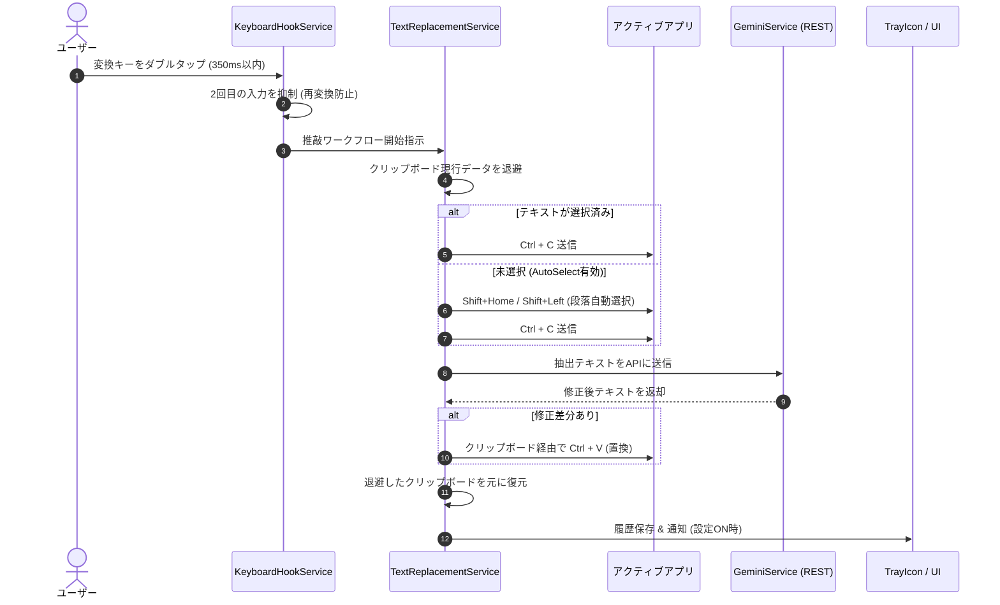

# IMESupport - AI日本語入力・文脈推敲支援ツール 仕様書兼取扱説明書

[-blue.svg)]()
[-purple.svg)]()
[]()
[]()

Windows上で動作する軽量・超高速なAI日本語入力・文脈推敲支援常駐ツールです。  
テキストを入力した直後や文章を選択した状態で**「変換キーを2回素早く押す（ダブルタップ）」**だけで、Gemini AIが文脈を即座に解析し、同音異義語の誤変換・タイピングミスによる不自然な文字列・脱字を瞬時に正しい日本語へ自動置換します。

---
> [!WARNING]
> **ご注意 / お願い**
> 本リポジトリは自分用のお試しプロジェクト（WIP）です。不具合や未実装機能が多数含まれています。
## 目次

1. [システム概要と設計方針](#-システム概要と設計方針)
2. [主要機能](#-主要機能)
3. [システムアーキテクチャ・動作仕様](#-システムアーキテクチャ動作仕様)
   - [キーボードフック＆ダブルタップ検知](#1-キーボードフックダブルタップ検知)
   - [スマート段落選択アルゴリズム](#2-スマート段落選択アルゴリズム)
   - [テキスト置換とクリップボード復元](#3-テキスト置換とクリップボード復元)
   - [Gemini API 連携＆プロンプト仕様](#4-gemini-api-連携プロンプト仕様)
   - [推敲履歴と差分ハイライト](#5-推敲履歴と差分ハイライト)
4. [データ・設定仕様](#-データ設定仕様)
5. [プロジェクト構成](#-プロジェクト構成)
6. [セットアップと利用方法](#-セットアップと利用方法)
7. [ビルドおよび発行手順](#-ビルドおよび発行手順)
8. [トラブルシューティングとセキュリティ](#-トラブルシューティングとセキュリティ)
9. [ライセンス](#-ライセンス)

---

## 🎯 システム概要と設計方針

### 開発の背景と目的
従来のIME（日本語入力システム）では、タイピングの誤打鍵や同音異義語の誤変換、送り仮名のミスを修正するために「バックスペースを連打して打ち直す」「矢印キーで戻って再変換する」といった作業が必要でした。  
本システムは、**「思考とタイピングの流れを一切止めない」**ことを目的に設計されたデスクトップ常駐型AIツールです。

### 基本方針
- **極小のオーバーヘッド**: 高速APIモデル（`gemini-2.5-flash` 等）と最適化された低レベルWin32 APIにより、ミリ秒単位でのレスポンスを実現。
- **あらゆるアプリに対応**: メモ帳、ブラウザ、VSCode、Word、Slack、Teams、Discordなど、Windows上でテキスト入力が可能な全アプリケーションに対応。
- **環境破壊ゼロ**: 一時利用したクリップボードは直前の状態へ完全復元され、Windowsのクリップボード履歴（Win+V）を汚しません。
- **タスクトレイ完全常駐**: メインウィンドウを持たず、タスクトレイ（通知領域）にバックグラウンド常駐します。

---

## 🌟 主要機能

1. **変換キー2回（ダブルタップ）発動**
   - 変換キー（または無変換、Ctrl等）の素早い2回打鍵で起動。
   - 2回目打鍵時のIME再変換ウィンドウの立ち上がりを自動抑制。
2. **文脈に応じたAIリアルタイム推敲**
   - **誤変換修正**: 文脈を考慮した同音異義語の最適化（例: 「変改」→「変換」、「機構」→「気候」）。
   - **タイピングミス予測補正**: キー誤打鍵、母音/子音抜けの補正（例: 「ありがとございます」→「ありがとうございます」、「よろしくおねがいしま」→「よろしくお願いします」）。
   - **脱字・送り仮名の補正**: 自然な日本語表現への整流化。
3. **スマート段落自動選択（未選択時）**
   - 文字列を選択していない状態でも、マウスのトリプルクリック相当で直前の改行（Enter）までの「現在の1段落」を正確に認識・自動選択。
4. **クリップボード自動復元**
   - 置換処理で一時的に使用したクリップボードを、推敲前の元データ（テキスト・画像等）へ完全復元。
5. **推敲履歴＆差分カラーハイライト表示**
   - 過去100件の修正履歴を記録。
   - 単語単位の差分（Diff）解析により、削除箇所（赤色・取消線）と追加箇所（緑色・太字）を視覚的にハイライト表示。
6. **ステータス通知トレイアイコン＆ダブルクリック履歴表示**
   - 外部ICOファイル依存ゼロの高品質動的ベクター描画（万年筆ペン先 ＋ AIキラキラ星）。
   - 推敲状況に応じたリアルタイム色変化（待機: ロイヤルブルー、処理中: アンバーオレンジ、修正完了: エメラルドグリーン、修正不要: スレートグレー、エラー: クリムゾンレッド、一時停止: ダークスレート）。
   - トレイアイコンのダブルクリックで「推敲履歴」ウィンドウを瞬時に起動。
7. **柔軟なカスタマイズ性**
   - 使用モデル（Gemini 2.5 Flash, 2.0 Flash, 3.5 Flash-Lite等）、ダブルタップ判定間隔（ms）、プロンプトの自由編集が可能。

---

## 📐 システムアーキテクチャ・動作仕様



### 1. キーボードフック・ダブルタップ検知
- **Win32 API**: `SetWindowsHookEx(WH_KEYBOARD_LL, ...)` を利用した低レベルグローバルフック。
- **アルゴリズム**:
  - 1回目のキー押下（KeyDown → KeyUp）時に高精度タイムスタンプ（`Stopwatch.GetTimestamp()`）を記録。
  - 設定されたインターバル（初期値: 350ms）以内に同一キーが再度押された場合、ダブルタップとして判定。
  - フックの戻り値として `(IntPtr)1` を返し、Windows IME へのメッセージ伝播をブロック（IMEの再変換ウィンドウ表示を防止）。
  - 他の無関係なキーが間に挟まれた場合は即座にステートをリセット。

### 2. スマート段落選択アルゴリズム
テキスト未選択時、カーソル直前の1段落を安全に抽出します：
1. `Shift + Home` を送信して現在の行頭まで選択。
2. `Shift + Left` で1文字ずつ左へ遡り、`\n` または `\r` を検知するまで拡張（最大15行分遡及）。
3. 改行文字の手前まで戻すことで、入力欄全体を巻き込まず、直前の Enter キー以降の「現在の1段落」のみを厳密に抽出。

### 3. テキスト置換とクリップボード復元
- **クリップボード監視**: `GetClipboardSequenceNumber()` をポーリングし、Ctrl+C によるコピー完了をミリ秒単位で確実に検知。
- **スナップショット退避**: STAスレッド上で `Clipboard.GetDataObject()` を取得・保持。
- **完全復元**: テキスト置換完了後（Ctrl+V 後）、退避したデータオブジェクトを `Clipboard.SetDataObject(original, true)` で再セット。

### 4. Gemini API 連携・プロンプト仕様
- **エンドポイント**: `https://generativelanguage.googleapis.com/v1beta/models/{model}:generateContent`
- **モデル設定**:
  - デフォルト: `gemini-2.5-flash`（超低レイテンシ・高精度）
  - 指定可能: `gemini-2.0-flash`, `gemini-3.5-flash-lite`, `gemini-1.5-flash` 等
- **システム指示（デフォルト）**:
  - 原文の口調（敬体/常体、ニュアンス）を維持。
  - 余計な解説文、挨拶、Markdownコードブロック、引用符を出力せず、修正後文章のみをダイレクト出力。
  - 修正が不要な場合は原文をそのまま返す。

### 5. 推敲履歴と差分ハイライト
- `Services/DiffHelper.cs` にて最長共通部分列（LCS: Longest Common Subsequence）アルゴリズムを実装。
- 修正前と修正後の差分をトークン/文字単位で比較。
- WPF リッチテキストブロック上で、削除部分（赤色背景・取消線）と追加部分（緑色背景・太字）を色分け描画。

### 6. ステータス通知トレイアイコン（動的ベクター描画）
- GDI+（`System.Drawing`）により、「万年筆ペン先 ＋ AIキラキラ星」アイコンを動的生成（外部ICOファイルへの依存なし）。
- バックグラウンドで推敲処理・結果に応じてリアルタイムに配色が変化し、2.5秒後に通常色へ自動復帰：
  | 状態 | アイコン色 | 意味 |
  |---|---|---|
  | `Idle` | 🟦 ロイヤルブルー | 通常待機中 |
  | `Processing` | 🟧 アンバーオレンジ | Gemini API 推敲中 |
  | `Success` | 🟩 エメラルドグリーン | 文章修正・置換完了 |
  | `NoChange` | ⬜ スレートグレー | 推敲完了（修正箇所なし） |
  | `Error` | 🟥 クリムゾンレッド | API通信エラー / 失敗 |
  | `Paused` | ⬛ ダークスレート | 機能一時停止中 |

---

## 💾 データ・設定仕様

### 設定ファイル (`settings.json`)
設定ファイルは以下の優先順位で読み込み・保存されます：
1. アプリケーション実行フォルダ直下の `settings.json`（ポータブル配置時）
2. `%APPDATA%\IMESupport\settings.json`（通常インストール時）

#### 設定パラメータ一覧
| 項目 | 型 | デフォルト値 | 説明 |
|---|---|---|---|
| `ApiKey` | `string` | `""` | Google Gemini API キー |
| `Model` | `string` | `"gemini-2.5-flash"` | 使用するGeminiモデル識別子 |
| `DoubleTapIntervalMs` | `int` | `350` | ダブルタップの最大間隔（200〜600ms） |
| `TriggerKeyType` | `string` | `"Convert"` | トリガーキー種別 (`Convert`, `NonConvert`, `CtrlDouble`, `Custom`) |
| `TriggerVirtualKey` | `int` | `0x1C` | トリガーの仮想キーコード (VK_CONVERT) |
| `ShowNotification` | `bool` | `false` | 置換完了時のトースト通知フラグ |
| `PlaySoundOnComplete` | `bool` | `false` | 完了時のビープ音再生フラグ |
| `RestoreClipboard` | `bool` | `true` | クリップボード履歴自動復元フラグ |
| `AutoSelectLineWhenEmpty` | `bool` | `true` | 未選択時の1段落自動選択フラグ |
| `AutoStart` | `bool` | `false` | Windowsログオン時の自動起動フラグ |
| `SystemPrompt` | `string` | (定義値) | AI推敲用プロンプトテンプレート |

---

## 📁 プロジェクト構成

```
IMESupport/
├── App.xaml / App.xaml.cs           # アプリケーションライフサイクル・常駐・二重起動制御
├── GlobalUsings.cs                 # グローバル名前空間エイリアス
├── AssemblyInfo.cs                 # アセンブリ属性定義
├── IMESupport.csproj               # プロジェクト定義 (.NET 8.0, WPF + WinForms)
├── Models/
│   ├── AppSettings.cs              # 設定モデル・JSONシリアライザ
│   └── CorrectionHistory.cs        # 推敲履歴データモデル
├── Services/
│   ├── GeminiService.cs            # Gemini REST API 通信・パース
│   ├── KeyboardHookService.cs      # Win32 低レベルキーボードフック (WH_KEYBOARD_LL)
│   ├── TextReplacementService.cs   # テキスト抽出・自動置換・クリップボード復元
│   ├── DiffHelper.cs               # 履歴差分解析・カラーハイライト生成
│   └── StartupManager.cs           # レジストリ (HKCU) スタートアップ制御
├── UI/
│   ├── SettingsWindow.xaml(.cs)    # 設定ダイアログ・APIテスト・キー設定
│   ├── HistoryWindow.xaml(.cs)     # 推敲履歴一覧・差分ビューア
│   └── TrayIconManager.cs          # 通知領域トレイアイコン・右クリックメニュー
└── tests/                          # ユニットテストプロジェクト
    ├── AppSettingsTests.cs
    ├── DiffHelperTests.cs
    └── IMESupport.Tests.csproj
```

---

## 🚀 セットアップと利用方法

### 1. 前提条件
- **OS**: Windows 10 (バージョン 1809 以降) または Windows 11 (64-bit)
- **ランタイム**: [.NET 8.0 Desktop Runtime](https://dotnet.microsoft.com/download/dotnet/8.0)（単一EXE配布版を使用する場合はインストール不要）
- **Gemini API キー**: [Google AI Studio](https://aistudio.google.com/) から無料で取得可能

### 2. 初回起動手順
1. `IMESupport.exe` を起動します。
2. 初回起動時、自動的に「設定画面」が表示されます。
3. **Gemini API キー**を入力し、**「API接続テスト」**をクリックして通信確認を行います。
4. 「保存して閉じる」をクリックすると、タスクトレイ（通知領域）に青い万年筆アイコンで常駐します。

### 3. 基本操作
- **推敲の実行**:
  - テキストを入力した直後に、キーボードの **「変換」キーを素早く2回押します**。
  - 文字列の一部のみを推敲したい場合は、マウスや矢印キーで選択した状態で2回押します。
- **トレイアイコンのダブルクリック（左クリック）**:
  - **📜 推敲履歴**: 直前の推敲結果や差分ハイライト画面を瞬時に開きます。
- **トレイメニュー（右クリック）**:
  - **⚙️ 設定**: APIキー、モデル、トリガーキー、判定間隔、プロンプトの編集
  - **📜 推敲履歴**: 差分ハイライト付き推敲ログ一覧
  - **⏸️ 機能を一時停止**: キー監視の一時中断（アイコンがダークスレートに変化）
  - **🔔 デスクトップ通知を表示**: トースト通知表示のON/OFF切り替え
  - **🚀 Windows起動時に自動実行**: スタートアップ登録の切り替え
  - **❌ 終了**: アプリケーションの終了

---

## 🔨 ビルドおよび発行手順

### 開発ビルド
```powershell
# 依存関係の復元とビルド
dotnet build
```

### 単一実行ファイル（Self-contained なし・軽量版）の発行
```powershell
dotnet publish IMESupport.csproj -c Release -r win-x64 --self-contained false -p:PublishSingleFile=true -o ./publish
```

### 完全自己完結型EXE（.NETランタイム同梱版）の発行
```powershell
dotnet publish IMESupport.csproj -c Release -r win-x64 --self-contained true -p:PublishSingleFile=true -p:IncludeNativeLibrariesForSelfExtract=true -o ./publish-standalone
```

### ユニットテストの実行
```powershell
dotnet test tests/IMESupport.Tests.csproj
```

---

## 🛡️ トラブルシューティングとセキュリティ

### 管理者権限アプリでの入力について
Windowsのセキュリティ仕様（UIPI: User Interface Privilege Isolation）により、通常の権限で動作するプロセスは管理者権限で実行中のウィンドウ（例: 管理者コマンドプロンプトや一部のインストーラ）に対してキー入力を送信できません。これらのアプリで推敲機能を利用する場合は、`IMESupport.exe` を「管理者として実行」してください。

### APIキーの取り扱い
入力された Gemini API キーは、ローカルマシンの `%APPDATA%\IMESupport\settings.json`（またはポータブル設定ファイル）にのみ保存され、外部のサードパーティサーバーへ送信されることはありません。また、`.gitignore` によりGit管理から自動的に除外されます。

---

## 📄 ライセンス

本プロジェクトは [MIT License](LICENSE) のもとで公開されています。
